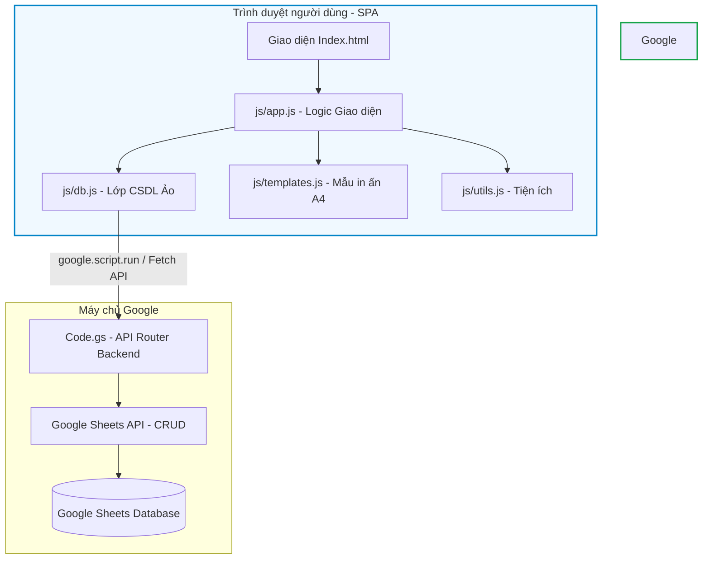

# Tài liệu Thiết kế & Kiến trúc Hệ thống TQC

Tài liệu này giải thích chi tiết về mặt thiết kế (Design), luồng logic xử lý (Logic), mô hình kiến trúc (Architecture) và các công nghệ cốt lõi (Technology) được áp dụng trong hệ thống Quản lý Vật liệu Xây dựng TQC.

---

## 1. Kiến trúc Hệ thống (System Architecture)

Hệ thống được thiết kế theo mô hình **Serverless 2 lớp (Two-Tier Architecture)** tối giản và gọn nhẹ, tối ưu hóa hạ tầng miễn phí của Google Workspace.

### Các thành phần chính:
1. **Presentation Layer (Lớp hiển thị - Frontend SPA)**:
   - Giao diện người dùng chạy hoàn toàn dưới dạng Single Page Application (SPA) trong một file `Index.html` duy nhất.
   - Tự động thay đổi trạng thái (hiển thị/ẩn các Page ảo) qua Javascript mà không cần tải lại trang.
2. **Business Logic & Persistence Layer (Lớp xử lý & Lưu trữ - Backend)**:
   - Google Apps Script đóng vai trò là một API server không trạng thái (stateless API).
   - Google Sheets đóng vai trò là Cơ sở dữ liệu quan hệ đơn giản lưu trữ thông tin thực tế.

---

## 2. Thiết kế Giao diện & Trải nghiệm (Design Aesthetics)

Hệ thống áp dụng phong cách thiết kế **Minimalism & Modern Tech** với các đặc điểm:
- **Bảng màu (Color Palette)**:
  - Màu chủ đạo: Xanh lam công nghệ Pastel (`--primary`: `#2563eb`, `--primary-pale`: `#dbeafe`).
  - Màu nền: Gradient chuyển tiếp mượt mà giữa các tông màu sáng mịn (`#f0f9ff` đến `#dbeafe`).
  - Chữ hiển thị: Màu xanh đậm đen sang trọng (`--text-dark`: `#1e3a5f`), tạo độ tương phản tốt mà không bị gắt như màu đen tuyền.
- **Typography**: Sử dụng font chữ **Be Vietnam Pro** thông qua Google Fonts, đem lại cảm giác hiện đại, nét chữ tròn trịa dễ đọc trong môi trường chuyên nghiệp.
- **Hiệu ứng chuyển động (Micro-animations)**:
  - Hover chuyển màu mượt mà trên sidebar navigation, các nút bấm.
  - Hiệu ứng `fadeIn` khi chuyển đổi trang, hiệu ứng trượt nhẹ `modalIn` khi mở hộp thoại tạo trải nghiệm mượt mà.
  - Trạng thái loading và thông báo toast tự biến mất sau 3 giây để giữ giao diện gọn gàng.

---

## 3. Luồng Logic Xử lý (Logic Flow)

### 3.1. Client-side Code (Index.html)
Các khối script được tổ chức ảo thành 4 file JS mô đun:
1. **`js/utils.js` (Hàm tiện ích)**:
   - `genId()`: Sinh ID ngẫu nhiên cho bản ghi mới dựa trên timestamp và chuỗi ngẫu nhiên.
   - Định dạng ngày tháng (`formatDate`), tiền tệ (`fmtCurrency`) theo chuẩn Việt Nam.
   - `docSoTien()`: Logic chuyển đổi từ số tiền (ví dụ: `355000`) sang chữ Tiếng Việt (ví dụ: *Ba trăm năm mươi lăm nghìn đồng*) để điền vào phiếu xuất kho A4.
2. **`js/db.js` (Lớp CSDL & Giao tiếp API)**:
   - Có cơ chế **Dual-Mode Communication**:
     - *Online Mode*: Nếu phát hiện đối tượng toàn cục `google.script.run`, hệ thống sẽ gọi trực tiếp các hàm API trong `Code.gs` (tốc độ nhanh hơn, chạy trực tiếp trong Apps Script container).
     - *Local/Offline Mode*: Nếu chạy file HTML local, hệ thống tự động fallback sử dụng `fetch()` gửi POST request dạng JSON đến Web App URL được cấu hình.
   - Hỗ trợ **Local Cache** (`cache`): Khi tải trang, hệ thống gọi `loadAll()` để nạp trước toàn bộ danh sách Khách hàng, Sản phẩm, Vận chuyển và Cấu hình vào bộ nhớ đệm giúp tìm kiếm/truy xuất tức thì mà không cần truy vấn Sheet liên tục.
3. **`js/templates.js` (Mẫu in hóa đơn A4)**:
   - Chứa mã nguồn HTML/CSS dạng chuỗi định dạng để render xem trước biên nhận (phiếu giao hàng) khổ giấy A4 chuẩn hóa.
4. **`js/app.js` (Quản lý ứng dụng)**:
   - Xử lý các sự kiện click, đóng mở modal, lắng nghe submit form để gọi các hàm CRUD trong `DB`.
   - Tìm kiếm và bộ lọc thời gian theo khách hàng, biển số xe.
   - Xuất dữ liệu báo cáo ra file Excel định dạng đẹp bằng thư viện `xlsx-js-style`.

### 3.2. Server-side Code (Code.gs)
Cung cấp các API Endpoint và điều hướng nghiệp vụ:
- **`doGet(e)`**: Trả về giao diện Web App cho người dùng. Nếu có tham số `action`, nó sẽ hoạt động như một REST API GET.
- **`doPost(e)`**: Nhận chuỗi JSON gửi lên, phân tích và gọi router xử lý.
- **`apiHandler(params)`**: Điểm kết nối bảo mật cho luồng gọi trực tiếp `google.script.run` từ trình duyệt.
- **`route(p)`**: Bộ định tuyến switch-case điều khiển các tác vụ:
  - `init`: Tạo các sheet cần thiết và ghi cấu hình mặc định (khách hàng, sản phẩm).
  - `read`: Đọc dữ liệu từ sheet và chuyển đổi dòng dữ liệu thành mảng đối tượng JSON.
  - `create`: Thêm dòng mới vào sheet tương ứng.
  - `update`: Tìm dòng dựa trên ID và ghi đè giá trị mới.
  - `delete`: Xóa dòng dựa trên ID.

---

## 4. Mô hình Dữ liệu (Database Schema)

Cơ sở dữ liệu lưu trong Google Sheets gồm 4 bảng dữ liệu chính:

### Bảng 1: `CauHinh` (Cấu hình công ty)
| Cột | Kiểu dữ liệu | Mô tả |
| :--- | :--- | :--- |
| `key` | String (Khóa chính) | Mã cấu hình (ví dụ: `tenCongTy`, `diaChi`, `maSoThue`) |
| `value` | String | Giá trị cấu hình tương ứng |

### Bảng 2: `KhachHang` (Thông tin Khách hàng)
| Cột | Kiểu dữ liệu | Mô tả |
| :--- | :--- | :--- |
| `id` | String (Khóa chính) | Mã khách hàng (tự sinh) |
| `tenCongTy` | String | Tên doanh nghiệp/khách hàng |
| `daiDien` | String | Người đại diện liên hệ |
| `chucVu` | String | Chức vụ người đại diện |
| `diaChi` | String | Địa chỉ giao hàng/hóa đơn |
| `maSoThue` | String | Mã số thuế doanh nghiệp |

### Bảng 3: `SanPham` (Danh mục Sản phẩm)
| Cột | Kiểu dữ liệu | Mô tả |
| :--- | :--- | :--- |
| `id` | String (Khóa chính) | Mã sản phẩm |
| `ten` | String | Tên loại vật liệu (đá cấp phối, đá cát...) |
| `donVi` | String | Đơn vị tính (M3, Tấn...) |
| `donGia` | Number | Đơn giá bán tại mỏ |
| `donGiaVC` | Number | Đơn giá vận chuyển kèm theo |

### Bảng 4: `VanChuyen` (Nhật ký Vận chuyển)
| Cột | Kiểu dữ liệu | Mô tả |
| :--- | :--- | :--- |
| `id` | String (Khóa chính) | Mã chuyến hàng (tự sinh) |
| `ngay` | Date (yyyy-MM-dd) | Ngày thực hiện vận chuyển |
| `bienSoXe` | String | Biển số xe vận tải |
| `soChuyenCho` | Number | Số chuyến xe chạy |
| `khoiLuong` | Number | Khối lượng vận chuyển (m3/tấn) |
| `khachHangId` | String (Khóa ngoại) | Liên kết tới bảng `KhachHang` |
| `sanPhamId` | String (Khóa ngoại) | Liên kết tới bảng `SanPham` |
| `ghiChu` | String | Ghi chú thêm (nếu có) |

---

## 5. Công nghệ & Thư viện Sử dụng (Technologies)

1. **Google Sheets API & Apps Script Service**:
   - `SpreadsheetApp`: Dùng để tương tác, đọc ghi trực tiếp lên bảng tính Google Sheets.
   - `HtmlService`: Tạo giao diện web động từ file mẫu Index.html.
   - `ContentService`: Trả về dữ liệu JSON chuẩn cho API local client.
2. **xlsx-js-style**:
   - Thư viện client-side được nhúng thông qua CDN của `jsdelivr`.
   - Giúp tạo file Excel `.xlsx` trực tiếp từ phía client với các chức năng định dạng nâng cao như tô màu cột tiêu đề, kẻ khung viền nét đứt (border style), căn lề văn bản, định dạng tiền tệ chuyên nghiệp.
3. **Mermaid.js**:
   - Dùng để vẽ sơ đồ thiết kế kiến trúc hệ thống trực tiếp trong các file tài liệu Markdown.
